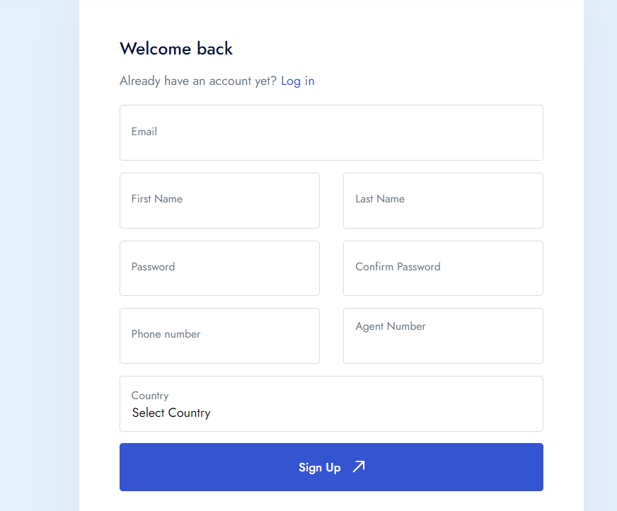
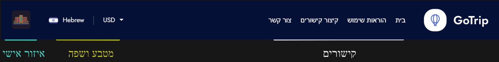
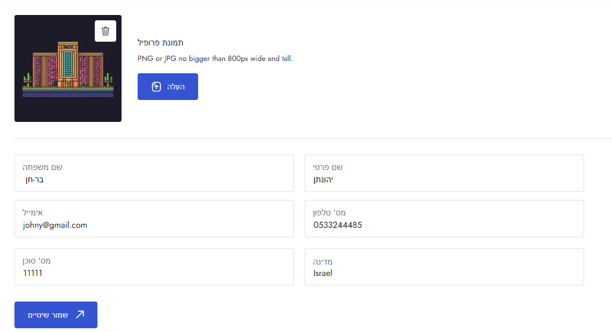
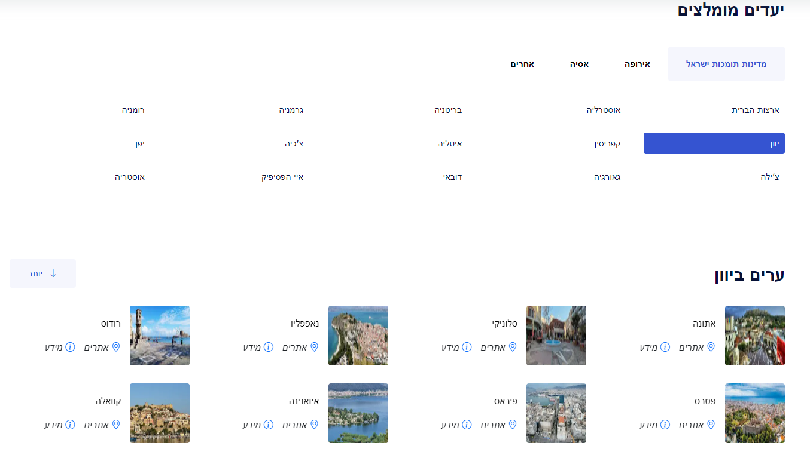
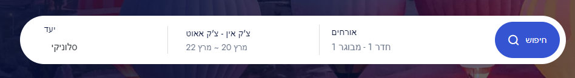
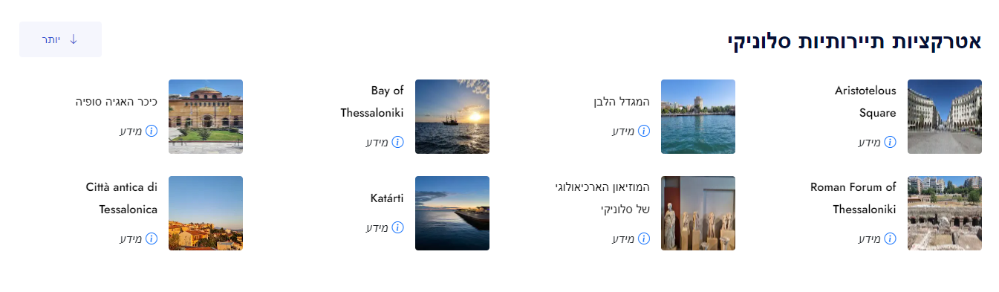
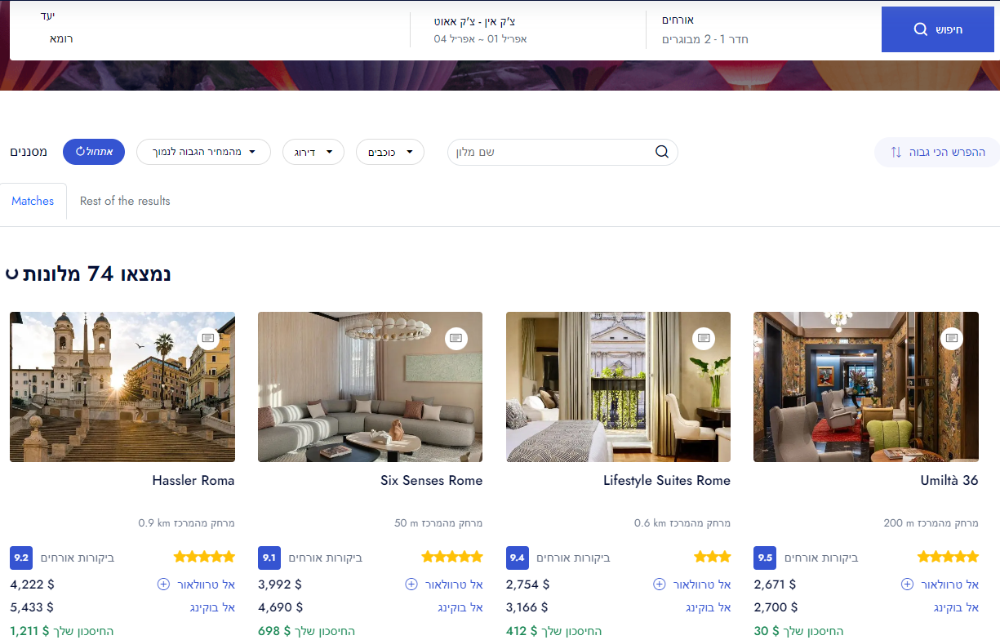
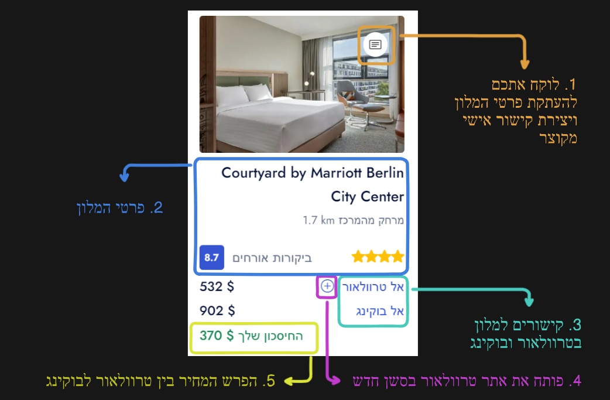
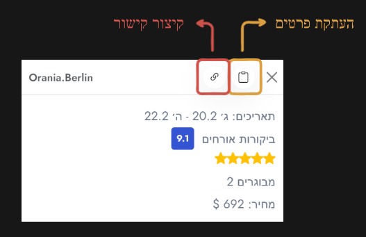
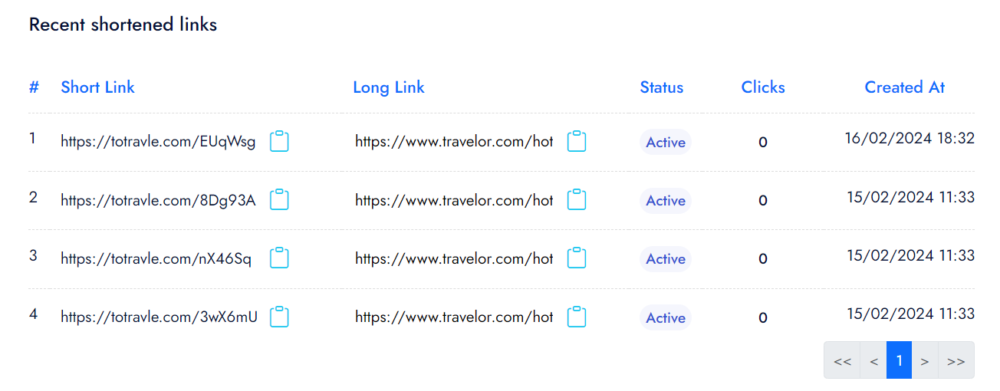

<body dir='rtl'>

# UserGuide1

#### מדריך למשתמש 

#### יצירת חשבון 

**חובה להיות מחוברים על מנת להשתמש באתר!!!**\

הכי פשוט שאפשר, ממלאים פרטים ונרשמים\
כרגע ניתן ליצור חשבון רק ע"י אימייל ולא על ידי חשבון גוגל, אז אל תנסו

\
ודאו שכל פרטי החשבון נכונים ובפרט השתיים הבאות:

- וודאו שהמדינה היא ישראל\
  האתר עושה שימוש בניתוב בקשות דרך שרתים ברחבי העולם , זאת אומרת שאם תסמנו במדינות "יוון" אתם תקבלו תוצאות כאילו אתם נמצאים ביוון, לכן סמנו את המדינה הרלוונטית עבורכם.
- מספר סוכן שלכם בטרוולאור\
  זה חשוב בשביל קיצור הלינקים (יובהר בהמשך), אם יהיה שם מספר סוכן לא נכון, כל הלינקים שתקצרו יובילו לאותו מספר סוכן\
  **כיוון שהאתר אישי, לא יהיה ניתן לשנות לאחר ההרשמה את מספר הסוכן אלא במקרים מיוחדים.**

#### תפריט 

\
\
בתפריט יש:

- קישורים רלוונטים
- אפשרות לבחור שפה: עברית/ אנגלית
- אפשרות לבחור את המטבע שהתוצאות יהיו בו: שקל/ דולר/יורו ועוד.
- כשלוחצים על תמונת הפרופיל שלכם מגיעים לאיזור האישי שלכם באתר

#### איזור אישי והגדרות 

באיזור האישי אתם יכולים לשנות את הפרטים האישיים שלכם או את הסיסמה

**דף הבית**

דף הבית מורכב מכמה חלקים:

- איזור החיפוש
- חיפוש ערים בתוך מדינות
- חיפוש אתרי תיירות פופלארים בערים

**איזור החיפוש**

כאן מכניסים את הפרטים על מנת לחפש

בהמשך מוסבר כיצד לחפש בצורה נכונה

**חיפוש ערים לפי מדינות**

כדי לעזור לכם בחיפוש ישנו פיצ'ר, חיפוש לפי מדינות:

ברגע שלוחצים על מדינה מקבלים את הערים באותה המדינה\
**כשלוחצים על אחת מהערים, האתר ממלא באופן אוטומטי את פרטי אותה העיר בשורת החיפוש, ואז אתם יכולים לבחור תאריכים ולחפש**

למשל אם אלחץ על סלוניקי זה ימלא אותה אוטומטית בשורת החיפוש:

\

בנוסף אפשר ללחוץ על:

- מידע נוסף, כדי לקבל מידע נוסף על אותה העיר בגוגל
- אתרים, ולקבל אתרי תיירות פופלארים באותה העיר

**חיפוש יעדי תיירות באיזור כל עיר:**

פיצ'ר נוסף, ניתן לקבל את כל המקומות המתויירים ביותר באותו איזור\
יכול לעזור לכם למצוא מקומות להמליץ ללקוחות

אם אלחץ על אייקון "אתרים" שנמצא ליד כל עיר, זה מה שאקבל

\
קיבלתם את כל האטרקציות באיזור סלוניקי.

\
גם כאן, ניתן ללחוץ על מידע נוסף כדי לקבל עוד מידע על אותו יעד בגוגל

#### &#x20;ביצוע חיפוש 

\
\
ביצוע חיפוש באתר הוא הכי פשוט שיש

ממלאים את הפרטים הנכונים ולוחצים חיפוש.\
תוך כמה שניות עד דקה, אתם תקבלו תוצאות לפרטים שהזנתם.

**קבלת תוצאות**\

לדוגמא תוצאות לרומא:

נעבור דבר דבר:\
כאן נמצאו 74 מלונות, בהם טרוולאור יותר זולים מבוקינג\
האתר מוצא מלונות רבים ומסנן רק את המלונות בהם טרוולאור יותר זולים מבוקינג.

המטרה היא שאתם תוכלו להוסיף עמלה שמנה ועדיין להיות בסביבת המחיר של בוקינג או זולים יותר.

ניתן להשתמש במסננים (פילטרים) כדי למצוא את המלונות עם ההפרש הכי גבוה/ מלונות הכי זולים/ מלונות רק מעל דירוג מסויים/ רק עם רמת כוכבים מסויימת.

מתחת המסננים/פילטרים, יש 2 כרטיסיות:

1. התאמות עם בוקינג (matches)
2. שאר המלונות של של טרוולאור באותו יעד (rest of the results)

ארד יותר לפרטים של כל מלון:\

הסבר מה זה כל אובייקט:

1\. העתקת פרטי המלון- ברגע שאתם לוחצים על זה ייפתח חלון קופץ שיאפשר לכם להעתיק את פרטי המלון ולקצר קישורים מותאמים אישית למספר הסוכן שלכם (מהאיזור האישי) בלחיצת כפתור. הרחבה בנושא בהמשך.\
2\. פרטי המלון, כמה כוכבים, ביקורות ומרחק מהמרכז\
3\. קישורים לטרוולאור ולבוקינג כדי לבצע הזמנות

4\. **פתיחה בסשן חדש בטרוולאור**, שימו לב, זה אחד חשוב.\
המחירים באתר טרוולאור דינאמיים ומשתנים כל הזמן, ניתן לפתוח את טרוולאור על ידי סשן קיים או בסשן חדש,\
בכל אחד מהמקרים תקבלו תוצאות קצת שונות, לפעמים התוצאה בסשן החדש שתקבלו תהיה זולה יותר בכמה עשרות דולרים, אז למה לא לבדוק?\
מומלץ לפתוח את טרוולאור גם מהסשן הישן וגם החדש ולבדוק איפה המחיר טוב יותר.

5\. הפרש המחיר בין טרוולאור לבוקינג\
כאן נמצא ה\$$$, אם אתם מוכרים את המלון הזה אתם יכולים להוסיף עמלה של 370$ ועדיין להיות באותו מחיר כמו בוקינג (בשקלים זה 1,334 ש"ח, תוספת עמלה לא רעה), ולפעמים ההפרשים גדולים עוד יותר.

**העתקת פרטי המלון ויצירת קישור מקוצר אישי**

מאוד לא אלגנטי לשים קישור כזה בתוך הודעה שמפרסמים ללקוחות

[https://www.travelor.com/hotels/place/de/4253410?fid=11111\&check_in=2024-02-20\&check_out=2024-02-22\&guests=a\&country=IL\&currency=USD\&session=9b59c6a1-b013-4e3e-bab0-1f300d70c8d3](https://www.travelor.com/hotels/place/de/4253410?fid=11111&check_in=2024-02-20&check_out=2024-02-22&guests=a&country=IL&currency=USD&session=9b59c6a1-b013-4e3e-bab0-1f300d70c8d3)

לכן רוב הסוכנים מקצרים את הקישורים שלהם באתרים כמו bitly, didly ודומיהם\
אבל, ביטלי למשל מגבילים אתכם לקיצור 80 קישורים בחודש במינוי החינמי, והבעיה היותר גדולה, זה לוקח הרבה זמן לקחת קישור קישור, להעתיק לשירותי קיצור קישורים ולהעתיק חזרה לתוך ההודעה

אנחנו חוסכים מכם את זה, לכן הוספנו באתר מערכת מובנית לקיצור קישורים.\
המערכת מסונכרנת עם מספר הסוכן שלכם שמוגדר באיזור האישי ועם כל מלון שאתם מעתיקים.

אם תלחצו על "קצר קישור" ואז תלחצו על העתקה, תקבלו את הפרטים כולל הקישור

אם תעתיקו בלי לקצר את הקישור קודם תקבלו את הפרטים ללא הקישור

הקישור שמקוצר הינו הקישור לרכישת המלון דרך טרלוואור\
ניתן לראות את הקישורים שקיצרתם בלוח הבקרה שלכם באיזור האישי, או להעתיק אותם משם שוב אם הם נמחקו לכם\
כך זה נראה:

**שימו לב: כרגע כל הקישורים שמקוצרים דרך האתר, פג תוקפם לאחר חודשיים, זאת אומרת שהם יפסיקו לעבוד לאחר הזמן הזה, הסיבה היא שבדרך כלל דילים שמפרסמים הופכים להיות לא רלוונטיים לאחר פרק הזמן הזה.**

בלוח הבקרה אתם תוכלו לראות

- את הלינק הארוך
- הלינק המקוצר
- את הסטטוס של הלינק (אם הוא פעיל)
- כמה קליקים הלינק קיבל\

**איזה מחיר האתר מוצא?**

האתר מוצא את המחיר הראשוני שמוצג בתוצאות החיפוש בבוקינג ובטרוולאור, שזה בדרך כלל המחיר הזול ביותר הזמין עבור אותו החדר, זאת אומרת שלא בהכרח המחירים שמוצגים יהיו לאותו סוג חדר. יכול להיות שהמחיר בבוקינג הוא עבור חדר דלוקס והמחיר בטרוולאור הוא עבור חדר קלאסי. ולכן מומלץ להיכנס לקישורים ולבדוק בעצמיכם עבור איזה חדר המחיר.

מה שכן, אם המחיר הנמוך ביותר בבוקינג הוא עבור חדר דלוקס, זה אומר שלבוקינג אין במלאי חדרי קלאסיק (אז בכל מקרה יש לטרוולאור יתרון על בוקינג מהבחינה הזו)

על ידי המחיר הזול ביותר אתם מקבלים אינדיקציה טובה שטרוולאור באופן כללי זולים יותר באותו המלון.

#### דברים שחשוב לשים לב בחיפוש 

1. לא לחפש עבור יעד גדול מדי: אם תחפשו תוצאות למשל ל"ישראל" האתר יחפש מלונות עבור המילה "ישראל", וכיוון שישנם הרבה מלונות בישראל, כל אתר יציג מלונות באיזורים שונים ברחבי ישראל ולא תיווצר התאמה.\
   לכן אתם צריכים להזין יעד מדוייק, כמו "כיכר ציון, ירושלים", ואז האתר ימצא לכם התאמות באותו איזור\
   בקיצור, תהיו ספציפיים בחיפוש.
2. כמות אורחים בחדר: לא כל מלון מאפשר שהיה של יותר מ2-3 אנשים בחדר. אם תזינו "2 מבוגרים, 2 ילדים" ותחפשו, לא כל מלון יאפשר את כמות האורחים הזו, ולכן אתם תצמצמו את כמות ההתאמות שאתם עשויים לקבל (עדיין תקבלו התאמות פשוט יהיו פחות)\
   אם אתם לא מקבלים תוצאות עבור 4 אורחים בחדר, נסו לחלק את החיפוש ל2 חדרים נפרדים, כך תקבלו יותר תוצאות.
3. כעושים המרה בין מטבעות לעיתים התוצאות לא יהיו מדוייקות על השקל, אבל יהיו קרובות מאוד למחיר שמוצג. המחיר המדוייק ביותר יהיה בדולרים. $
4. אם אתם מחוברים בדפדפן לחשבון האישי שלכם בבוקינג לפעמים אתם עשויים לקבל הנחות אישיות שיגרמו למחירים לא להיות תואמים, אבל אם תתנתקו מהחשבון האישי תראו שהמחירים תואמים.
5. קוקיז /cookies, (נתונים למעקב ולאגירת מידע על אודות גולש באתר אינטרנט, כגון שמירת העדפות המשתמש) עשויים גם לגרום לזה שהתוצאות בדפדפן שלכם יהיו לא תואמות לתוצאות שמוצגות באתר.\
   אם אתם רואים שהמחיר שמוצג באתר לא תואם למחיר האמיתי בבוקינג, נסו לפתוח את הקישור לבוקינג בחלון גלישה בסתר (אינקוגיטו), מבדיקות שעשינו הקוקיז יכולות להשפיע על התוצאות שתקבלו במאות דולרים.

**הערה בנושא דינאמיות המחירים בטרוולאור**

משהו שכדאי שתדעו גם לידע הכללי:

אתר בוקינג הינו ספק בפני עצמו, כל המלונות שאתם מזמינים דרכו הוא הספק.\
טרוולאור הינו אתר שמחבר ביניכם לבין מאות ספקים שונים.

מהסיבה הזו לפעמים כשאתם תחפשו בטרוולאור אתם תקבלו חדרים מסויימים ומחירים מסויימים, ואם תחפשו שוב מחלון גלישה בסתר או חלון חדש אתם עשויים לקבל חדרים שונים ומחירים שונים.

במילים אחרות- המחירים באתר טרוולאור מתעדכנים באופן מהיר, כמעט בכל פעם שפותחים את האתר מקבלים מחיר שונה.

אנו עושים את מירב המאמצים כדי שהמחירים שאתם תקבלו בחיפוש אצלינו יהיו כמה שיותר קרובים למחירים האמיתיים בטרוולאור, אבל לעיתים יכולות להופיע לכם כאשר תחפשו ידנית תוצאות ומחירים שונים מעט ממה שיוצג באתר שלנו.

#### עדכניות התוצאות 

בטרוולאור כשאתם רואים מלון כתוב לכם "ההצעה תקיפה ל30 דקות", האם זה בעיה?\

לא, אין שום בעיה, טרוולאור מעדכנים את התוצאות כל חצי שעה, כדי לוודא את עדכניות המחירים מול הספקים, אבל בדרך כלל השינויים הם לא גדולים, זאת אומרת, אם אתם תפרסמו מלון ועברה חצי שעה, או יום או שבוע, הלקוח עדיין יוכל לראות את המלון ואת החדרים, הדבר היחיד שעשוי לקרות הוא שהמחיר ישתנה קצת או שחלק מהחדרים לא יהיו זמינים כי מישהו אחר הזמין אותם.

בקיצור, אין לכם מה לדאוג מכך, הדבר היחיד שמומלץ לכתוב הוא שהמחיר עשוי להשתנות.

#### שיווק מלונות טרוולאור על ידי קישורים 

היתרון הגדול ביותר שהאתר מציע הוא שיווק קישורים

בשילוב של כלי החיפוש, כלי העתקת הטקסט וכלי קיצור הקישורים

אתם יכולים למצוא את המלונות הזולים ביותר של טרוולאור ליעד מסויים, לקצר עבורם קישור ולהעתיק את הפרטים בתוך 2 דקות, ואז לשתף את זה בקבוצות וואצפ/פייסבוק/כל רשת חברתית אחרת.

שיווק הקישור הינו אפיק רווח שעדיין לא מומש מספיק על ידי סוכני החברה

אנחנו מאמינים שבעזרת האתר כל אחד על ידי השקעה של 5-10 דקות ביום יכול לייצר הכנסה של מאוד ואלפי שקלים בחודש רק משיווק הקישור

#### מחירים 

כיוון שיש עלויות בהפעלת האתר, השימוש באתר כרוך במינוי חודשי\
סכום סמלי שכל אחד יוכל להרשות לעצמו

ניתן לראות את המחירים העדכניים [כאן](https://agent-space.com/he/pricing)

</body>
